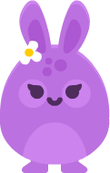

 

  
  <h3 align="center">Project Saltarina</h3>

## About The Project

![Saltarina Screen Shot][ product-screenshot ]

Saltarina it's a game platformer totally inspired in others games like Mario and Ori. This one is my first game completely playable. Made with love

(<a href="#top">back to top</a>)

### Built With

This project has been made totally using Godot Engine.

* [Godot Engine](https://godotengine.org/)

(<a href="#top">back to top</a>)

## Getting Started

In this repository You have two forms to execute the game. The first one is open the project in your editor from Godot and execute in this place.
The second one is just execute the ".exe" in de root folder.

### Prerequisites

If you want to execute the first option, you need to have download the Godot Engine.

### Installation

After this you have to open the Godot and import the project after that you can execute the game.

(<a href="#top">back to top</a>)

# PSaltarina

[product-screenshot]: https://manuel-ortiz-portfolio.vercel.app/_next/image?url=%2F_next%2Fstatic%2Fmedia%2Fsaltarina.10d4bba8.png&w=1920&q=75
